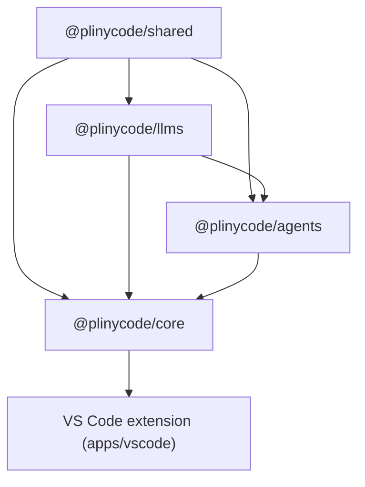

# PlinyCode Engine Packages — Development Reference

The packages under `sdk/packages/` are the engine the VS Code extension (`apps/vscode`) runs on. They are not a distributable SDK. Toolchain, repo layout and naming rules are in the root [AGENTS.md](../AGENTS.md); this file covers package boundaries and how to verify engine changes.

## Where to run commands

The repo root is the Bun workspace root: `sdk/` has no `package.json`. Run every command below from the repo root.

## Package Boundaries

### Engine Packages

- `@plinycode/shared`: shared contracts, schemas, path helpers, hook engine, extension registry, low-level utilities
- `@plinycode/llms`: provider settings/config, model catalogs, provider manifests, gateway contracts, handler creation
- `@plinycode/agents`: stateless agent loop, tool orchestration, hook/extension runtime, event streaming
- `@plinycode/core`: stateful orchestration, session lifecycle, storage, config watching, plugin loading, default tools, telemetry. Exposes `@plinycode/core/hub` for discovery, the detached daemon entry, WebSocket clients, and session/UI client adapters, plus `@plinycode/core/hub/daemon-entry` for launching the shared daemon
- `@plinycode/ui`: shared webview theme and React components. It depends only on `shared` and sits outside the runtime chain below

### Dependency Direction



Rules:
- `shared` stays low-level and reusable
- `agents` stays stateless — no session/storage/config concerns
- `core` owns stateful orchestration, including the shared-hub daemon, server, and client adapters under `src/hub/`

## Change Routing

Route changes to the package that owns the concern:

- model/provider schemas or handler behavior: `@plinycode/llms`
- stateless loop, tool orchestration, streaming, hook/extension runtime: `@plinycode/agents`
- session lifecycle, storage, config watching, default tools, plugin loading, telemetry, hub runtime services, hub discovery, hub daemon spawn, and session-oriented client helpers (`HubSessionClient`, `HubUIClient`, `connectToHub`): `@plinycode/core` (hub pieces live under `src/hub/`)
- remote-config schemas, managed instruction materialization, blob upload metadata, and OpenTelemetry config normalization: `@plinycode/shared/src/remote-config`
- host-specific UX or shell behavior: the extension, `apps/vscode`

## Verifying Changes

In a fresh clone or worktree, install dependencies first:

```sh
bun install --frozen-lockfile
```

Engine packages resolve each other through their compiled `dist/` output, so build them before running tests or the extension, and again after every engine source change:

```sh
bun run build:sdk
```

Cross-package checks:

```sh
bun run types       # typecheck the engine packages (not the extension)
bun run test        # engine and extension test suites
bun run lint        # Biome
bun run check:docs  # relative links in every tracked markdown file resolve
```

For focused verification, run one package's tests:

```sh
bun -F @plinycode/shared test
bun -F @plinycode/llms test
bun -F @plinycode/agents test
bun -F @plinycode/core test:unit
bun -F @plinycode/ui test
```

If a focused test command fails with a missing `@plinycode/*` export or missing `dist/` file, build the relevant dependency package or run `bun run build:sdk`, then rerun the same test command. Treat that as a workspace setup issue, not as evidence of a source-code bug.

## Practical Guidance

### Keep Boundaries Clean

- Don't move stateful logic down into `agents`
- For `@plinycode/llms` provider/model routing rules, follow [packages/llms/AGENTS.md](./packages/llms/AGENTS.md).
- Don't put app-specific behavior into `core` unless it is truly shared host behavior
- Keep remote-config primitives generic in `shared`; host-facing session integration belongs in `core`

### Refactor Standard

- Prefer direct architectural cleanup over compatibility shims
- Move code to the layer that owns the concern and update all call sites
- If a helper just projects watcher state, keep it with the config layer instead of creating thin runtime wrappers

## Documentation

- Each package's `README.md` describes what it exports. Update it when that surface changes.
- `@plinycode/core`'s message persistence contract is in [packages/core/docs/messages-contract-v1.md](./packages/core/docs/messages-contract-v1.md).
- This file owns package boundaries, dependency rules and change routing. Update it when those change.
